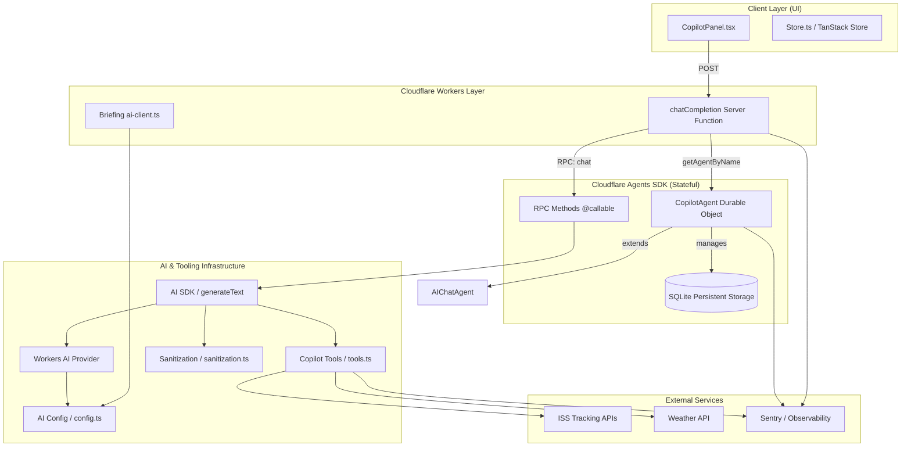
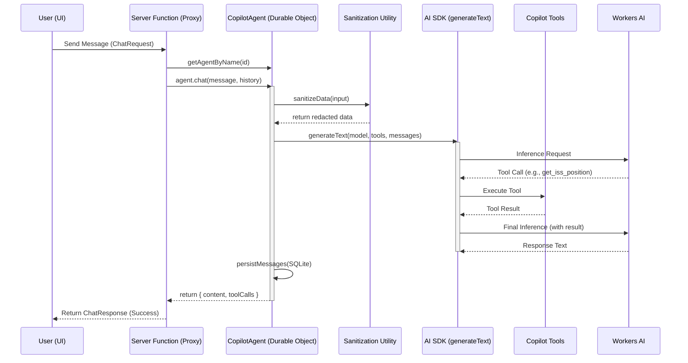

# Cloudflare Agent SDK Architecture

This diagram illustrates the stateful agent architecture implemented for the Observation Copilot using the Cloudflare Agents SDK.

## Component Overview

## Request Lifecycle (Walkthrough)

The following sequence diagram shows the flow of a single chat message through the new architecture.

## Key Architectural Principles

1.  **Stateful Identity**: Each conversation is mapped to a specific Durable Object instance, ensuring session persistence and server-side history.
2.  **Centralized Configuration**: All AI-related settings (models, retries, iterations) are managed in a single `config.ts` module.
3.  **Security by Default**: The `sanitization.ts` utility is applied at the agent level to ensure sensitive data never leaves the secure environment.
4.  **RPC Communication**: Communication between the stateless Server Functions and the stateful Agent is handled via high-performance RPC calls.
5.  **Standardized Tools**: Tools follow the modern AI SDK format, making them compatible with both the Agents SDK and standard Workers AI patterns.
